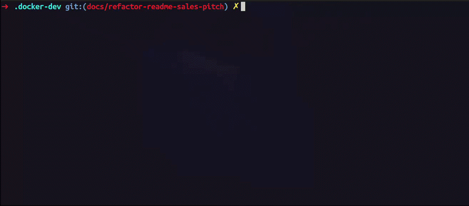

# docker-dev

[](https://github.com/HASH3-dev/docker-dev/blob/main/package.json)
[](https://github.com/HASH3-dev/docker-dev/releases)
[](#requisitos)
[](./LICENSE)

## Seu ambiente de desenvolvimento também é parte da cadeia de suprimentos

Contas de mantenedores comprometidas, pacotes maliciosos e scripts de instalação
injetados mostram que o risco pode entrar antes de o código chegar à produção.
O problema não pertence a uma linguagem específica: toda dependência resolvida
ou instalada merece controles consistentes. O `docker-dev` torna scans e gates
de vulnerabilidades conhecidos repetíveis no ambiente local — sem alegar detectar
comprometimento, procedência ou malware em um pacote.

O `docker-dev` transforma o ambiente local em uma parte reproduzível,
versionada e isolada do projeto. Ele mantém o código em `/workspace`, instala os
runtimes definidos em `.tool-versions` com asdf e permite adicionar apenas os
plugins de linguagem, infraestrutura e segurança que o time precisa — sem
acoplar o núcleo a uma stack.

> **Segurança repetível, não promessa absoluta.** O `docker-dev` ajuda a aplicar
> verificações locais de forma consistente. Ele não substitui revisão de
> dependências, políticas de registro, gestão de credenciais ou controles de CI,
> nem garante que um pacote esteja livre de comprometimento.

### Veja o gate em ação



*Na primeira execução, o comando pode levar um tempo considerável para preparar
os dados do scanner. Nas execuções seguintes, com os dados em cache, ele é bem
mais rápido.*

### O que muda na prática

- **Menos “funciona na minha máquina”** — runtimes, portas, plugins e extensões
  Compose são definidos por arquivos versionados no projeto.
- **Menos dependência do host** — runtimes, caches e dependências vivem no
  container; o código continua disponível no diretório de trabalho.
- **Segurança no fluxo local** — scans de dependências, IaC, imagens, código e
  segredos podem rodar no mesmo ambiente usado para desenvolver.
- **Atualizações previsíveis** — o arquivo `.docker-dev-version` mantém toda a
  equipe na mesma versão do binário.

## Requisitos

- Linux ou macOS. No Windows, o suporte é via **WSL 2**.
- Docker com o plugin Docker Compose (`docker compose`).
- Um executável `docker-dev` no `PATH` ou disponível por caminho absoluto.

## Instale e fixe a versão do time

Na raiz do projeto que receberá o ambiente, execute:

```bash
curl -fsSL https://raw.githubusercontent.com/HASH3-dev/docker-dev/main/scripts/install.sh | bash
```

O instalador detecta o sistema e a arquitetura, baixa o binário para
`./docker-dev` e o adiciona ao `.gitignore`. No Windows, execute o comando
dentro do WSL 2.

> **Nota de confiança:** este é um método de conveniência: ele executa um script
> vindo da branch `main` e baixa um binário de release. O projeto ainda não
> publica nem verifica checksums ou assinaturas. Quando precisar revisar o
> instalador antes de executá-lo, baixe-o primeiro:
>
> ```bash
> curl -fsSLO https://raw.githubusercontent.com/HASH3-dev/docker-dev/main/scripts/install.sh
> less install.sh
> bash install.sh 0.11.0
> ```

### Transforme a versão em um contrato

A versão é resolvida nesta ordem:

1. argumento passado ao instalador;
2. versão já registrada em `.docker-dev-version`;
3. versão publicada no `package.json` do repositório.

Fixe, versione e faça commit da escolha para que todas as pessoas usem o mesmo
binário:

```bash
curl -fsSL https://raw.githubusercontent.com/HASH3-dev/docker-dev/main/scripts/install.sh | bash -s -- 0.11.0
git add .docker-dev-version
git commit -m "chore: pin docker-dev version"
```

O instalador salva o binário no projeto; por isso, os exemplos abaixo usam
`./docker-dev`.

## Atualize sem perder previsibilidade

Para instalar a versão fixada no projeto:

```bash
./docker-dev update
```

Para instalar uma versão específica e atualizar o pin após uma instalação bem-sucedida:

```bash
./docker-dev update 0.11.0
```

`setup` e `rebuild` recusam executar se a versão do binário não corresponder a
`.docker-dev-version`. Antes de continuar, rode `./docker-dev update`.

```bash
# Lista as releases disponíveis no GitHub.
./docker-dev update --list

# Mostra a versão atual, a versão fixada e a última release.
./docker-dev update --check
```

## Configure uma vez; compartilhe com o time

```bash
./docker-dev setup
```

O assistente cria ou atualiza `.docker-dev`, define portas expostas somente em
`localhost`, lê ou cria `.tool-versions`, oferece plugins compatíveis e inicia o
container para instalar os runtimes selecionados.

Antes de qualquer alteração no host, o `setup` pede confirmação explícita. Isso
pode incluir instalar o `direnv`, adicionar um bloco gerenciado à inicialização
do shell e criar/autorizar um `.envrc` gerenciado. Ele não substitui um `.envrc`
existente que não seja gerenciado. Ao terminar, abra um novo terminal — ou aceite
o terminal oferecido pelo assistente — para carregar o `direnv`.

Para refazer escolhas de portas, runtimes e plugins:

```bash
./docker-dev setup --force
```

A seleção inicial inclui Trivy, Semgrep, Bearer, Gitleaks e o dashboard de
relatórios. O seletor do `setup` permite alterar essa escolha e versionar o
resultado.

## Use todos os dias

```bash
# Abre uma shell no container de desenvolvimento.
./docker-dev up

# Executa um comando no container.
./docker-dev run git status

# Para o ambiente e preserva volumes.
./docker-dev down

# Acompanha os logs.
./docker-dev logs

# Recria a imagem e o container.
./docker-dev rebuild

# Substitui assets gerenciados modificados localmente.
./docker-dev rebuild --force
```

`./docker-dev shell` é um alias de `./docker-dev up`.

### Infraestrutura Compose do projeto

Para subir também a infraestrutura Compose do projeto:

```bash
./docker-dev up --merge-compose
```

Para aplicar um arquivo Compose adicional por último:

```bash
./docker-dev up --merge-compose --merge-file compose.dev.yml
```

A precedência é: configuração base, plugins e portas, `custom-compose.yml` e,
por último, o arquivo informado por `--merge-file`.

### Limpeza consciente

```bash
# Para o ambiente e remove volumes de dependências, caches, runtimes e home.
./docker-dev reset

# Remove o container gerenciado do serviço dev e a configuração .docker-dev.
./docker-dev teardown
```

`reset` remove estado persistente, inclusive caches, runtimes e sessões de
plugins que usam o volume home. `teardown` remove o container do serviço `dev` e
o diretório `.docker-dev`, mas não remove volumes nem a infraestrutura Compose
mesclada do projeto: revise ou faça backup de alterações locais intencionais
antes de executá-lo.

## Segurança como capacidade do ambiente

Com os plugins correspondentes habilitados, use scans sob demanda dentro do
ambiente de desenvolvimento. Os comandos abaixo analisam a raiz do projeto;
acrescente um caminho de projeto opcional quando necessário.

```bash
# Vulnerabilidades de dependências.
./docker-dev trivy:scan

# Configurações inseguras em IaC, Dockerfiles e Compose.
./docker-dev trivy:scan-iac

# Imagens de registry referenciadas no projeto.
./docker-dev trivy:scan-images

# Análise estática de código.
./docker-dev semgrep:scan
./docker-dev bearer:scan

# Segredos no histórico Git ou diretório de trabalho.
./docker-dev gitleaks:scan
```

Os scans gravam relatórios JSON em `.docker-dev/reports/`. Em geral, retornam
status diferente de zero quando encontram itens na severidade configurada; use
`--no-fail` para gerar o relatório sem falhar o comando. O scan de imagens
consulta imagens de registry referenciadas por Dockerfiles e Compose, mas **não
monta nem acessa o socket Docker**.

### Gate opcional antes da instalação de dependências

Quando o Trivy e o subplugin do gerenciador correspondente forem selecionados no
`setup`, uma nova shell com `direnv` carregado pode encaminhar Bun, npm, pnpm,
Yarn e uv pelo `docker-dev`.

Para operações compatíveis, o adaptador cria uma resolução temporária sem scripts
de pacote, analisa o lockfile com Trivy e só executa a instalação real se o gate
não retornar erro. Isso reduz a exposição a dependências com vulnerabilidades
conhecidas na cobertura e severidade configuradas; não verifica procedência, não
faz análise de malware e não prova que pacotes não foram comprometidos.

Nem toda operação ou argumento de cada gerenciador é coberto. Executar o
comando fora da shell configurada ou usar um fluxo não suportado pode contornar o
adaptador. Consulte a ajuda e a configuração do subplugin antes de torná-lo uma
política do time.

### Relatórios são dados sensíveis

Para visualizar os relatórios localmente:

```bash
./docker-dev reports:dashboard --port 8080
```

Configure a mesma porta local em `.docker-dev/ports.env` e abra
`http://127.0.0.1:8080`. O dashboard relê os relatórios a cada atualização do
navegador. Não o exponha publicamente: relatórios, sobretudo os de segredos,
podem conter informações sensíveis. Comentários e ignorados são registrados em
`.docker-dev/reports/ignores.json`.

## O que versionar

A configuração compartilhada vive em `.docker-dev`. Versione:

- `.docker-dev-version`;
- `.docker-dev/ports.env` — `DOCKER_DEV_PORTS=` não publica nenhuma porta;
- `.docker-dev/plugins/plugins.enabled` e os `plugins.enabled` aninhados;
- `.docker-dev/.ports.generated.yml` e `.docker-dev/.plugins.generated.yml`;
- `.docker-dev/custom-compose.yml` — extensão e sobrescrita de Compose.

`custom-compose.yml` começa com:

```yaml
services:
  dev: {}
```

O executável local `docker-dev` e `.docker-dev-state.json` são específicos da
instalação e permanecem no `.gitignore` criado pelo setup.

## Ajuda e contribuição

```bash
./docker-dev --help
./docker-dev setup --help
./docker-dev up --help
```

Para arquitetura, desenvolvimento, testes e criação de plugins, consulte o
[guia de contribuição](./CONTRIBUTING.md).

## Por que isso importa

- [GitHub: plano para uma cadeia de suprimentos npm mais segura após ataques recentes](https://github.blog/security/supply-chain-security/our-plan-for-a-more-secure-npm-supply-chain/)
- [npm: ameaças e mitigação na cadeia de suprimentos](https://docs.npmjs.com/threats-and-mitigations/)
